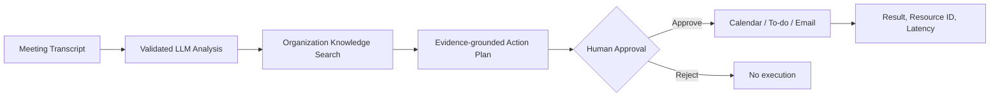

# IEUM — Enterprise Meeting-to-Action Agent

[](https://github.com/henryeffel/ai_agent/actions/workflows/backend-ci.yml)

IEUM은 회의 Transcript를 조직 지식에 근거한 실행 계획으로 변환하고, 사용자 승인 후 Calendar·To-do·Email 업무를 수행하는 Human-in-the-loop AI Workflow Agent입니다.

## 해결하는 문제

회의 요약만으로는 실제 업무가 진행되지 않습니다. IEUM은 회의의 결정과 후속 작업을 구조화하고, 조직 문서에서 근거를 검색하고, 승인된 작업만 외부 생산성 도구로 실행합니다. 근거 부족, 중복 실행, 일부 도구 실패도 명시적인 상태로 다룹니다.



## 핵심 설계

- LLM JSON을 Pydantic schema로 검증한 뒤에만 사용합니다.
- 검색 근거가 없으면 실행 계획 생성을 거부합니다.
- 승인 전 실행을 차단합니다.
- API dependency에서 주입한 identity의 `approver`·`executor` 역할을 검사합니다.
- DB 조건부 상태 전이와 고유 `action_id`로 중복·동시 실행을 방지합니다.
- 외부 도구별 결과를 저장하고 `PARTIALLY_SUCCEEDED`를 구분합니다.
- Provider 경계로 Mock과 실제 연동 adapter를 교체할 수 있습니다.
- 요청과 Action 실행을 `request_id`로 연결한 JSON audit log를 남깁니다.

## 로컬 재현과 실제 연동

| 영역 | 로컬·CI | 실제 연동 선택지 |
|---|---|---|
| LLM | Mock | NVIDIA NIM |
| 검색 | Mock 또는 PostgreSQL/pgvector | PostgreSQL/pgvector |
| 업무 실행 | Mock Microsoft 365 | Logic Apps 또는 Microsoft Graph adapter |
| Legacy 기능 | 비활성화 | `APP_MODE=azure`에서만 등록 |

Logic Apps와 Microsoft Graph adapter는 구현되어 있지만 실제 자격증명, tenant consent나 서명 URL은 저장소에 포함하지 않습니다. Graph HTTP 계약은 mock으로 검증했으며 실제 Microsoft tenant 운영 배포를 주장하지 않습니다.

## 빠른 실행

```bash
cd ms-2nd-project-integration-ver-1/Backend
python -m pip install -r requirements.txt
set APP_MODE=mock
set LLM_PROVIDER=mock
set PRODUCTIVITY_PROVIDER=mock
set VECTOR_SEARCH_PROVIDER=mock
alembic upgrade head
uvicorn main:app --reload
```

PowerShell에서는 `set` 대신 `$env:APP_MODE="mock"` 형식을 사용합니다. API 문서는 `http://localhost:8000/docs`에서 확인할 수 있습니다.

공개 배포용 `APP_MODE=demo`는 NVIDIA LLM·Embedding, PostgreSQL/pgvector와 Mock Productivity 조합만 허용합니다. Legacy Azure Router와 외부 Knowledge 색인 API는 비활성화되며 승인·실행 identity는 사용자가 변경할 수 없는 고정 데모 계정을 사용합니다.

공개 샘플 문서는 `python -m ieum.demo seed`로 idempotent하게 색인하고, 만료된 Demo Plan은 `python -m ieum.demo cleanup --older-than-hours 24 --confirm`으로 정리합니다. 삭제 명령은 `demo-` scope 데이터만 대상으로 합니다.

배포 설정은 루트 `render.yaml`과 Frontend `vercel.json`에 있습니다. Supabase 전용 검증 DB에서는 `python scripts/verify_supabase.py --confirm-empty-database`로 migration과 pgvector E2E를 확인합니다. 현재 Frontend 일부 화면은 Legacy Azure API에 의존하므로 신규 Workflow API 전환 전에는 완전한 공개 Demo로 표시하지 않습니다.

Mock 모드의 승인·실행 API는 `X-Actor-Id`, `X-Actor-Email`, `X-Actor-Roles` 테스트 헤더를 지원합니다. 헤더를 생략하면 `mock-user`, `mock.user@example.com`, `approver,executor`가 사용됩니다. 이는 로컬 재현 전용이며 실제 인증을 의미하지 않습니다. Azure 모드의 신규 Workflow API는 Entra ID token 검증이 구현되기 전까지 identity dependency에서 501을 반환합니다.

## 주요 API

```text
POST /api/v1/meetings/analyze
POST /api/v1/knowledge/chunks
POST /api/v1/knowledge/search
POST /api/v1/action-plans/grounded
POST /api/v1/action-plans/{plan_id}/approve
POST /api/v1/action-plans/{plan_id}/reject
POST /api/v1/action-plans/{plan_id}/execute
POST /analyze-meeting  # 기존 React 호환 API
```

과거 Azure API는 `APP_MODE=azure`일 때만 등록됩니다.

## 테스트

```bash
cd ms-2nd-project-integration-ver-1/Backend
python -m pytest -q tests --ignore=tests/integration
python -m compileall ieum main.py
```

PostgreSQL/pgvector가 준비된 환경에서는 `python -m pytest -q tests/integration`을 실행합니다. GitHub Actions는 Mock 테스트, PostgreSQL 통합 테스트와 Backend Docker 이미지 빌드를 수행합니다.

DB schema는 Alembic이 관리합니다. 변경 적용은 `alembic upgrade head`, 한 단계 검증은 `alembic downgrade -1`을 사용합니다. 애플리케이션 요청 처리 중에는 table을 자동 생성하지 않습니다.

## 실행 추적

모든 HTTP 응답에는 `X-Request-ID`가 포함됩니다. 호출자가 같은 헤더를 보내면 해당 값을 사용하고, 없으면 서버가 UUID를 생성합니다. Action 로그에는 다음 allowlist 필드만 기록합니다.

```text
request_id, plan_id, action_id, meeting_id, provider,
tool, status, latency_ms, error_code
```

회의 transcript, Action payload, Secret, 서명 URL과 사용자 이메일 원문은 구조화 로그에 포함하지 않습니다.

## 프로젝트 구조

```text
ms-2nd-project-integration-ver-1/
├── Backend/
│   ├── main.py
│   ├── ieum/api/routers/
│   ├── ieum/providers/
│   ├── ieum/services/
│   └── tests/
├── src/                    # 기존 React UI
└── compose.yaml
docs/
├── implementation-progress.md
├── agentic-development-case-study.md
└── demo.md
```

## 기여 범위

- 기존 팀 프로젝트에서 백엔드와 AI Workflow 개발을 담당했습니다.
- 개인 저장소에서 Provider 추상화, 승인 Workflow, 멱등성, PostgreSQL/pgvector, Docker, CI와 테스트를 추가했습니다.
- 프런트엔드, STT와 화자 분리는 직접 구현 범위가 아닙니다.

## 현재 제한사항

- Mock 모드는 테스트 헤더 identity를 사용하며 실제 Entra ID token 검증은 아직 구현되지 않았습니다.
- Demo 모드는 공개 쓰기 피해를 줄이지만 rate limit과 만료 데이터 정리 작업은 아직 추가해야 합니다.
- Logic Apps 실제 호출은 사용자가 제공한 환경변수와 외부 권한이 필요합니다.
- RAG 평가는 작은 합성 lexical 데이터셋만 제공하며 실제 embedding 운영 품질을 대표하지 않습니다.
- 관리자 알림, OpenTelemetry와 Prometheus metric은 아직 구현하지 않았습니다.
- Legacy Azure application은 격리되어 있지만 내부 코드는 후속 정리가 필요합니다.

개발 판단과 검증 과정은 [Agentic Coding 사례](docs/agentic-development-case-study.md), 실행 예시는 [재현 가능한 데모](docs/demo.md), 현재 상태는 [구현 진행 기록](docs/implementation-progress.md)을 참고하세요.

RAG 전처리의 재현 가능한 소규모 비교는 [평가 안내](evaluation/rag/README.md)에서 확인할 수 있습니다.

Copilot Studio 또는 Power Platform Custom Connector에 연결하기 위한 제한된 OpenAPI와 보안 전제조건은 [연동 준비 문서](docs/copilot-studio-integration.md)를 참고하세요. 실제 tenant 연결이나 Entra ID 인증이 완료됐다는 의미는 아닙니다.

Graph 인증 모드, 최소 권한과 rate limit 처리 설계는 [Microsoft Graph Provider 문서](docs/microsoft-graph-provider.md)를 참고하세요.
