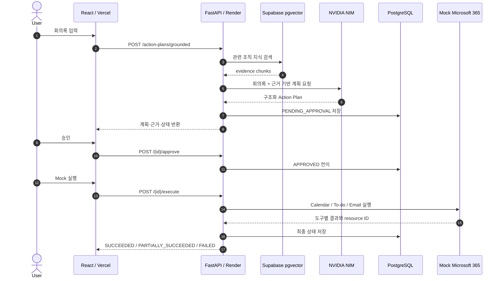
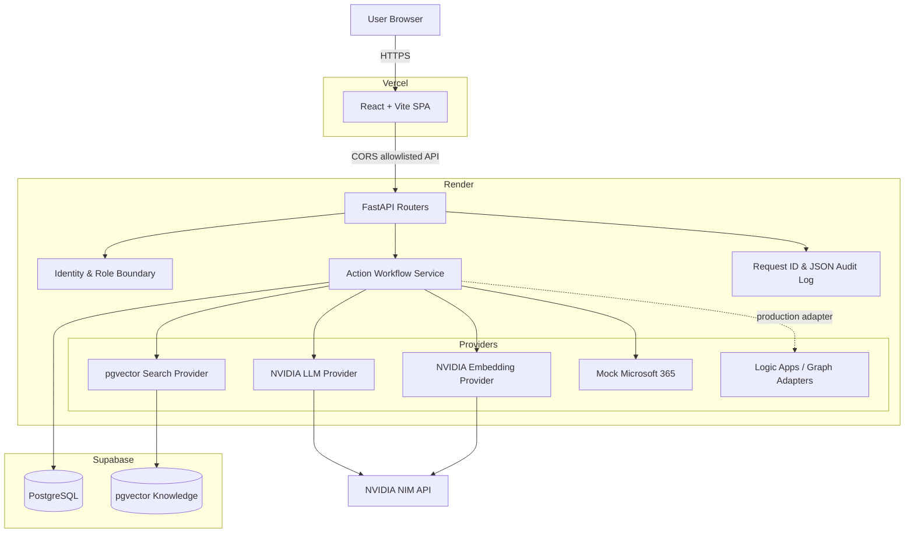
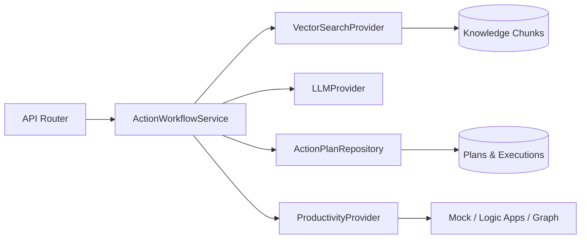
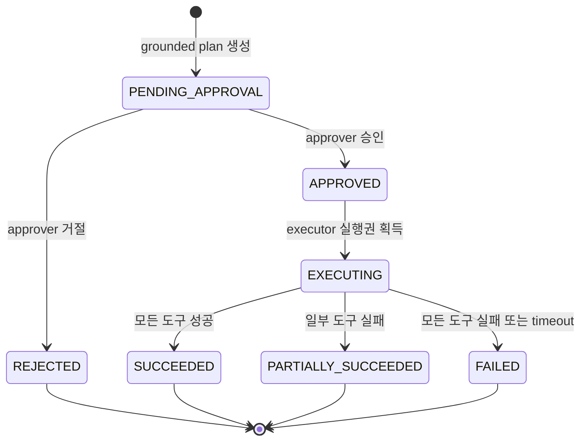

<h1 align="center">IEUM</h1>

<p align="center">
  회의록을 조직 지식에 근거한 실행 계획으로 바꾸고<br>
  <strong>사용자 승인 후에만 Calendar·To-do·Email 작업을 수행하는 Meeting-to-Action Agent</strong>
</p>

<p align="center">
  <a href="https://ai-agent-olive-nine.vercel.app"><strong>Live Demo</strong></a>
  ·
  <a href="https://ieum-api-sgqw.onrender.com/docs"><strong>API Docs</strong></a>
  ·
  <a href="docs/deployment-verification.md"><strong>배포 검증</strong></a>
  ·
  <a href="docs/README.md"><strong>전체 문서</strong></a>
</p>

<p align="center">
  
  
  
  
  
  
  <a href="https://github.com/henryeffel/ai_agent/actions/workflows/backend-ci.yml"></a>
</p>

---

## 프로젝트 소개

회의가 끝나도 업무는 자동으로 진행되지 않습니다. 결정 사항을 다시 정리하고,
관련 규정을 찾고, 일정·할 일·메일로 옮기는 과정에서 누락과 중복이 발생합니다.

IEUM은 회의록을 구조화하고 조직 지식을 검색해 **근거가 연결된 Action Plan**을
만듭니다. 계획은 즉시 실행되지 않으며, 승인 권한을 가진 사용자가 검토한 후
별도의 실행 요청을 보냈을 때만 외부 도구를 호출합니다.

```text
Meeting Transcript
  → Structured Analysis
  → Organization Knowledge Retrieval
  → Evidence-grounded Action Plan
  → Human Approval
  → Calendar / To-do / Email
  → Per-tool Result & Audit Log
```

공개 데모에서는 실제 회사 메일이나 일정을 만들지 않습니다. Microsoft 365 실행
계층을 Mock Provider로 교체해 승인, 상태 전이, 멱등성, 부분 실패와 실행 결과를
안전하게 확인할 수 있습니다.

## 핵심 결과

| 구분 | 결과 |
| --- | --- |
| 공개 배포 | Vercel Frontend + Render Backend + Supabase PostgreSQL |
| Agent Workflow | Plan 생성 → 승인 → Mock 실행 `SUCCEEDED` 운영 검증 |
| RAG | NVIDIA Embedding + Supabase pgvector 검색 |
| Human-in-the-loop | 승인 전 실행 차단, 승인과 실행 API 분리 |
| 실행 안전성 | 중복 action ID, 재실행과 동시 실행 차단 |
| 부분 실패 | 도구별 상태 저장 및 `PARTIALLY_SUCCEEDED` 구분 |
| Provider 경계 | Mock, Logic Apps, Microsoft Graph 구현체 분리 |
| 운영 모드 | Demo에서 Legacy Azure route와 실제 Productivity Provider 차단 |
| 자동 검증 | Backend `75 passed, 1 skipped`, Frontend production build 통과 |
| 관측성 | `X-Request-ID`와 payload 비저장 구조화 로그 |

> PostgreSQL 통합 테스트 1건은 전용 DB를 명시적으로 지정해야 실행되는 보호된
> 테스트입니다. 실제 Supabase migration, seed와 공개 Workflow는 배포 환경에서
> 별도로 검증했습니다.

## Live Demo

- Frontend: <https://ai-agent-olive-nine.vercel.app>
- Backend readiness: <https://ieum-api-sgqw.onrender.com/health/ready>
- Swagger UI: <https://ieum-api-sgqw.onrender.com/docs>

```text
1. 샘플 회의록 확인 또는 직접 입력
2. 근거 검색 및 Action Plan 생성
3. 검색 근거와 제안된 작업 검토
4. 사용자 승인
5. Mock Microsoft 365 실행
6. SUCCEEDED 상태와 Mock resource ID 확인
```

Render 무료 인스턴스가 절전 상태이면 첫 요청에 수십 초가 걸릴 수 있습니다.
공개 환경의 Productivity Provider는 `mock_microsoft_365`이며 실제 외부 부작용은
발생하지 않습니다.

## 사용자 및 API 흐름



## 주요 기능

### 1. 근거 기반 Action Plan

- 회의록을 summary, decisions, action items와 open issues로 구조화
- NVIDIA embedding과 pgvector cosine distance 기반 조직 지식 검색
- 검색된 chunk ID를 계획과 함께 저장해 실행 근거 추적
- 최소 유사도 기준을 충족하지 못하면 계획 생성 거부
- LLM JSON을 Pydantic schema로 검증한 후에만 저장

### 2. Human-in-the-loop 상태 전이

- Plan 생성과 외부 실행을 별도 API로 분리
- `approver` 역할만 승인·거절 가능
- `executor` 역할만 승인된 계획 실행 가능
- 거절된 계획과 미승인 계획의 실행 차단
- Demo mode에서는 신뢰할 수 없는 identity header를 무시하고 고정 Demo actor 사용

### 3. 안전한 도구 실행

- Calendar, To-do, Email을 공통 Productivity Provider 계약으로 추상화
- 고유 `action_id`로 중복 요청 차단
- DB 조건부 전이로 동시 실행 중 하나만 실행권 획득
- 성공·실패·latency·provider·external resource ID를 도구별 저장
- 일부 도구만 실패하면 전체를 성공으로 숨기지 않고 `PARTIALLY_SUCCEEDED` 반환

### 4. Provider 교체 구조

```text
LLM Provider
  ├─ Mock
  └─ NVIDIA NIM

Vector Search Provider
  ├─ Mock
  └─ PostgreSQL / pgvector

Productivity Provider
  ├─ Mock Microsoft 365       # 공개 Demo
  ├─ Logic Apps               # 기존 Azure 연동 계약
  └─ Microsoft Graph          # REST + OAuth token boundary
```

### 5. 운영 안전장치

- `APP_MODE=demo`에서 NVIDIA + pgvector + Mock Productivity 조합 강제
- Demo mode에서 PostgreSQL URL 강제
- Legacy Azure router 미등록 및 import 차단
- 공개 Knowledge index 쓰기 API 차단
- `postgresql://` URL을 psycopg 3 dialect로 자동 정규화
- Alembic migration → Demo seed → Uvicorn을 Python entrypoint에서 순차 실행
- CORS allowlist로 Vercel Production Origin만 허용

## 기술 스택

| 영역 | 기술 | 역할 및 선택 이유 |
| --- | --- | --- |
| Frontend | React 18, Vite, Chakra UI | 승인 흐름을 한 화면에서 보여주는 SPA |
| Backend | Python 3.12, FastAPI, Pydantic | 명시적인 API·schema 계약과 OpenAPI 제공 |
| ORM / Migration | SQLAlchemy 2.0, Alembic | 상태 전이 transaction과 재현 가능한 schema 관리 |
| Database | Supabase PostgreSQL | 공개 환경의 영속 데이터 저장 |
| Vector Search | pgvector | embedding 저장과 조직 지식 유사도 검색 |
| LLM / Embedding | NVIDIA NIM | OpenAI-compatible 구조화 분석과 embedding |
| Productivity | Mock, Logic Apps, Microsoft Graph | 공개 안전성과 실제 연동 경계를 동시에 유지 |
| Observability | JSON logging, X-Request-ID | 요청과 Action 실행 추적, 민감 payload 비저장 |
| Test | pytest, FastAPI TestClient | API, 상태 전이, provider, migration과 실패 경로 검증 |
| CI/CD | GitHub Actions, Render Blueprint, Vercel | 테스트 후 자동 배포와 환경별 secret 분리 |

## 전체 아키텍처

외부 Provider를 별도 서비스로 쪼개기보다, 현재 규모에서는 하나의 FastAPI 배포
단위를 유지하는 **Provider 기반 모듈러 모놀리스**를 선택했습니다. 서비스·저장소·
Provider 경계는 코드 수준에서 분리하고, 외부 시스템은 interface 뒤에서 교체합니다.



### Backend 내부 흐름



### Action Plan 상태 모델



## API

| Method | Endpoint | 설명 |
| --- | --- | --- |
| `GET` | `/health/live` | process liveness |
| `GET` | `/health/ready` | mode와 Provider readiness |
| `POST` | `/api/v1/meetings/analyze` | 회의록 구조화 분석 |
| `POST` | `/api/v1/knowledge/chunks` | 조직 지식 chunk index, Demo 쓰기 차단 |
| `POST` | `/api/v1/knowledge/search` | 유사 조직 지식 검색 |
| `POST` | `/api/v1/action-plans` | 명시적 Action Plan 생성 |
| `POST` | `/api/v1/action-plans/grounded` | RAG 기반 Action Plan 생성 |
| `GET` | `/api/v1/action-plans/{id}` | 계획·근거·도구 결과 조회 |
| `POST` | `/api/v1/action-plans/{id}/approve` | 계획 승인 |
| `POST` | `/api/v1/action-plans/{id}/reject` | 계획 거절 |
| `POST` | `/api/v1/action-plans/{id}/execute` | 승인된 계획 실행 |

Legacy Azure endpoint는 `APP_MODE=azure`일 때만 등록됩니다. 공개 Demo에서는
`/chat`, `/files`, `/upload`, `/execute-action` 등이 `404`를 반환합니다.

## 대표적인 기술적 문제 해결

### 승인과 실행을 하나의 요청에서 분리

초기 업무 자동화는 분석 결과를 바로 외부 도구로 전달할 수 있었습니다. 이 방식은
LLM 오류가 실제 메일과 일정으로 전파될 수 있습니다.

```text
Before: Analyze → Execute
After : Analyze → Persist PENDING_APPROVAL
                 → Human Approve
                 → Explicit Execute
```

승인자와 실행자의 역할을 분리하고 DB 상태 전이를 검증해 요청 body의 임의 actor나
중복 요청이 실행 권한을 만들지 못하도록 했습니다.

### 동시 실행과 부분 실패를 상태로 표현

메모리 flag가 아니라 DB의 조건부 상태 전이로 실행권을 획득합니다. 두 요청이 동시에
들어와도 하나만 `APPROVED → EXECUTING` 전이에 성공하며, 각 도구 결과는 독립적으로
저장됩니다.

```text
Calendar  SUCCEEDED
To-do     FAILED
Email     SUCCEEDED
→ Plan PARTIALLY_SUCCEEDED
```

### Azure 구독 만료를 Provider 경계로 전환

과거 Azure AI Search, Blob Storage와 Logic Apps에 직접 의존하던 구조는 구독이
없으면 재현할 수 없었습니다. LLM·Vector Search·Productivity 계층을 Provider로
분리해 공개 환경을 NVIDIA NIM, Supabase와 Mock Microsoft 365로 교체했습니다.
Logic Apps와 Microsoft Graph adapter는 실제 업무 환경 전환 경로로 보존합니다.

### Render와 Supabase 배포 장애 해결

배포 과정에서 셸 해석, 드라이버 선택과 인증 문제를 각각 분리해 해결했습니다.

```text
Render sh -c / && parsing failure
  → shell-independent `python -m ieum.start`

SQLAlchemy selecting psycopg2
  → generic PostgreSQL URL normalized to psycopg 3

Supabase Session pooler auth failure
  → postgres.PROJECT_REF username + port 5432

Repeated authentication failure
  → credential correction + Supavisor circuit-breaker cooldown
```

전체 장애 기록과 운영 검증은
[`deployment-verification.md`](docs/deployment-verification.md)에 있습니다.

## 검증 전략

```text
Unit
  → schema, chunker, URL normalization, identity, provider contract
Integration
  → API state transition, migration, repository and pgvector workflow
Concurrency
  → duplicate action ID and simultaneous execution claim
Failure path
  → timeout, partial failure, insufficient evidence, invalid transition
Mode boundary
  → Demo provider combination and Legacy Azure route isolation
Deployment
  → Render Blueprint, Vercel SPA, CORS and public end-to-end workflow
```

로컬 자동 검증:

```powershell
Set-Location ms-2nd-project-integration-ver-1\Backend
python -m pip install -r requirements.txt
python -m pytest -q
```

결과:

```text
75 passed, 1 skipped
```

Frontend production build:

```powershell
Set-Location ms-2nd-project-integration-ver-1
npm ci
npm.cmd run build
```

운영 환경에서는 CORS preflight, readiness, grounded plan 생성, 승인과 Mock 실행까지
직접 검증했습니다.

## 로컬 실행

### Backend

```powershell
Set-Location ms-2nd-project-integration-ver-1\Backend
python -m venv .venv
.\.venv\Scripts\Activate.ps1
python -m pip install -r requirements.txt

$env:APP_MODE = "mock"
$env:LLM_PROVIDER = "mock"
$env:EMBEDDING_PROVIDER = "mock"
$env:VECTOR_SEARCH_PROVIDER = "mock"
$env:PRODUCTIVITY_PROVIDER = "mock"

python -m alembic upgrade head
python -m uvicorn main:app --reload
```

- Swagger UI: <http://127.0.0.1:8000/docs>
- Liveness: <http://127.0.0.1:8000/health/live>
- Readiness: <http://127.0.0.1:8000/health/ready>

### Frontend

```powershell
Set-Location ms-2nd-project-integration-ver-1
npm ci
$env:VITE_API_URL = "http://127.0.0.1:8000"
npm.cmd run dev
```

브라우저에서 <http://localhost:5173>을 엽니다.

## 배포 구성

```text
GitHub main
  ├─ render.yaml → Render Docker Web Service
  │                    ├─ Supabase Session pooler
  │                    └─ NVIDIA NIM
  └─ vercel.json → Vercel React SPA
```

Render secret:

```text
DATABASE_URL
NVIDIA_API_KEY
ALLOWED_ORIGINS
```

Vercel environment:

```text
VITE_API_URL=https://ieum-api-sgqw.onrender.com
```

실제 credential과 전체 Database URL은 저장소에 commit하지 않습니다.

## 프로젝트 구조

```text
.
├─ README.md
├─ render.yaml
├─ docs/
│  ├─ deployment-verification.md
│  ├─ implementation-progress.md
│  ├─ agentic-development-case-study.md
│  └─ ...
├─ evaluation/rag/
└─ ms-2nd-project-integration-ver-1/
   ├─ src/
   │  ├─ pages/DemoWorkflow.jsx
   │  └─ lib/api.js
   ├─ vercel.json
   └─ Backend/
      ├─ main.py
      ├─ alembic/
      ├─ ieum/
      │  ├─ api/routers/
      │  ├─ demo/
      │  ├─ ingestion/
      │  ├─ observability/
      │  ├─ providers/
      │  ├─ security/
      │  └─ services/
      ├─ scripts/verify_supabase.py
      └─ tests/
```

## 주요 설계 결정과 Trade-off

| 결정 | 선택 | 감수한 한계 |
| --- | --- | --- |
| 실행 정책 | 명시적 승인 후 별도 실행 | 클릭 단계가 늘지만 외부 부작용 통제 |
| 공개 Productivity | Mock Microsoft 365 | 실제 생성 화면 대신 안전한 상태 전이 증명 |
| 서비스 구조 | Provider 기반 모듈러 모놀리스 | 독립 배포보다 현재 운영 단순성 우선 |
| Vector DB | PostgreSQL + pgvector | 전용 검색 서비스 기능보다 이식성과 비용 우선 |
| Demo identity | 서버 고정 actor | 공개 시연은 단순하지만 실제 사용자 인증 아님 |
| Legacy Azure | Demo에서 router 미등록 | 과거 기능을 공개 UI에서 직접 시연하지 않음 |
| Render free | 절전 허용 | 비용을 줄이는 대신 cold start 발생 |
| RAG 계획 | 최소 유사도 gate | 근거 없는 실행은 막지만 seed 품질에 민감 |

## 현재 한계와 다음 과제

- 공개 Demo는 실제 Entra ID 인증이 아니라 고정 Demo actor를 사용합니다.
- Microsoft Graph adapter는 HTTP mock으로 검증했으며 실제 tenant consent와 운영 token
  rotation은 아직 검증하지 않았습니다.
- NVIDIA 첫 요청에서 일시적인 `502`가 발생할 수 있어 제한적 retry와 UI 안내가
  필요합니다.
- 현재 seed 문서와 일부 샘플 회의록의 주제가 맞지 않아 검색 근거 관련성이 낮을 수
  있습니다.
- RAG 평가는 작은 합성 lexical dataset 기준이며 실제 조직 문서 corpus 평가가
  필요합니다.
- Render 무료 인스턴스 cold start 동안 “서버 시작 중” UX가 필요합니다.
- rate limiting, 만료 Demo 데이터 scheduler와 외부 모니터링을 추가해야 합니다.
- 실제 Graph/Logic Apps 실행은 별도 credential과 최소 권한 설정이 필요합니다.

## 문서

- [문서 인덱스](docs/README.md)
- [공개 배포 및 운영 검증](docs/deployment-verification.md)
- [구현 진행 기록](docs/implementation-progress.md)
- [Agentic 개발 사례](docs/agentic-development-case-study.md)
- [공개 Demo 안내](docs/demo.md)
- [공개 배포 계획](docs/open-demo-deployment-plan.md)
- [Microsoft Graph Provider](docs/microsoft-graph-provider.md)
- [Copilot Studio 연동](docs/copilot-studio-integration.md)
- [RAG 평가](evaluation/rag/README.md)

---

<p align="center">
  기능 목록뿐 아니라 <strong>승인 경계, 실패 상태, Provider 선택 이유와 실제 배포 검증</strong>을 함께 기록하는 프로젝트입니다.
</p>
