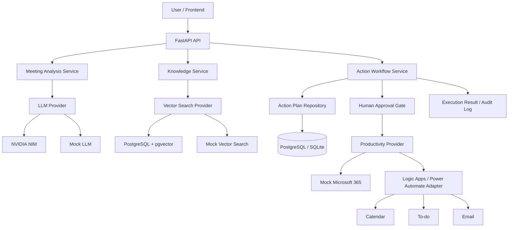

# IEUM — 인사이트365 JD 맞춤 프로젝트 개선 계획

> **대상 저장소**: `henryeffel/ai_agent`  
> **기준 코드베이스**: `ms-2nd-project-integration-ver-1`  
> **작성 기준일**: 2026-08-06  
> **지원 공고 마감**: 2026-08-09  
> **문서 목적**: Codex가 이 문서만 읽고도 우선순위, 변경 범위, 파일 구조, 테스트 기준을 이해하여 IEUM을 인사이트365의 Agentic Coding 개발자 JD에 맞는 포트폴리오로 개선할 수 있게 한다.

---

## 0. Codex 실행 지침

이 문서는 단순 제안서가 아니라 **구현 명세**다. 아래 원칙을 지킨다.

1. 작업 시작 전 현재 저장소 구조와 테스트를 먼저 확인한다.
2. 기존 동작을 추측하지 말고 코드와 테스트로 검증한다.
3. 한 번에 전체를 갈아엎지 말고 P0 작업을 작은 단계로 나눈다.
4. 각 단계가 끝날 때 관련 테스트를 실행한다.
5. 실제 Microsoft 365 자격증명 없이도 테스트 가능해야 한다.
6. 실제 연동을 구현한 것처럼 위장하지 않는다.
7. Secret, Logic Apps 서명 URL, 토큰, 실제 조직 이메일을 커밋하지 않는다.
8. 기존 React 프런트엔드 호환 API는 명시적으로 유지하거나 제거 이유를 문서화한다.
9. 신규 API와 Legacy Azure API의 책임을 분리한다.
10. 변경 후 README와 개발 로그를 반드시 갱신한다.

### 시작 전 실행

```bash
cd ms-2nd-project-integration-ver-1/Backend
python -m pytest -q tests --ignore=tests/integration
python -m compileall ieum main.py
```

PostgreSQL 또는 Docker 사용이 가능한 환경에서는 다음도 실행한다.

```bash
python -m pytest -q tests/integration
```

기준 테스트가 실패하면 기능 추가보다 실패 원인 기록과 복구를 우선한다.

---

# 1. JD와 회사 사이트에서 도출한 핵심 요구

## 1.1 채용 JD에서 확인되는 평가 기준

공고상 직무명은 **Agentic Coding 개발자**이며, 핵심 키워드는 다음과 같다.

- Agentic Coding
- Vibe Coding
- 적응성
- 창의성
- 협동심
- 메타인지
- 성장지향성
- 신입·학력무관

이 JD는 특정 언어 숙련도만 평가하는 전통적인 백엔드 공고가 아니다. 다음을 보여주는 프로젝트가 유리하다.

1. AI Coding Agent를 이용해 실제 제품을 끝까지 만든 경험
2. AI가 생성한 코드를 그대로 수용하지 않고 검증·수정한 과정
3. 문제를 작은 단위로 분해하고 질문을 설계한 이유
4. 실패를 발견하고 대안을 선택한 기록
5. 코드, 테스트, CI, 문서로 결과를 재현할 수 있는 상태
6. 다른 개발자나 고객에게 의사결정을 설명할 수 있는 능력

따라서 IEUM은 기능 수보다 다음을 증명해야 한다.

> **어떤 위험을 발견했고, 왜 그 위험을 먼저 해결했으며, AI Coding Agent의 결과를 어떤 테스트로 반박하거나 확정했는가.**

---

## 1.2 회사 사이트에서 확인되는 실제 사업 성격

인사이트365는 범용 AI 연구회사가 아니라 다음 영역을 중심으로 하는 **Microsoft 365 및 Power Platform 전문 B2B 개발·컨설팅 회사**다.

- Microsoft 365
- Power Platform
- Power Apps
- Power Automate
- Microsoft Teams
- SharePoint Online / SPFx
- Copilot Studio
- Microsoft Foundry
- Office Add-in
- Entra ID 및 M365 관리
- 기업 내부 시스템 연동
- 교육 및 컨설팅

회사 사례에서 반복되는 문제는 다음과 같다.

- 사내 문서 기반 검색 Agent
- Help Desk Agent와 지식 베이스 갱신
- 예약·근태·법인카드·VOC 처리 Agent
- 견적서 자동 생성과 제안서 추천
- 전자결재와 승인·반려
- 조건부 프로세스 전환
- 사용자·그룹 권한
- 자동 이력 기록
- 오류 발생 기록과 관리자 알림
- API 및 레거시 시스템 연동
- Teams·SharePoint·Power Apps 기반 업무 UI
- 독자적인 문서 전처리를 통한 Agent 품질 향상

### 회사 관점에서 IEUM의 올바른 제품 정의

기존 표현:

> 회의 요약과 RAG를 제공하는 AI 서비스

개선 표현:

> **회의에서 발생한 비정형 정보를 조직 지식과 연결하고, 근거 기반 실행 계획을 만든 뒤 사용자 승인 후 Microsoft 365 업무로 전환하는 Human-in-the-loop AI Workflow Agent**

---

# 2. 현재 IEUM 상태 요약

현재 저장소에서 확인되는 강점은 다음과 같다.

## 2.1 이미 구현된 핵심 흐름

```text
Meeting Transcript
    ↓
Structured Meeting Analysis
    ↓
Organization Knowledge Retrieval
    ↓
Grounded Action Plan Generation
    ↓
Human Approval / Rejection
    ↓
Calendar / To-do / Email Execution
    ↓
Per-action Result and Plan Status Recording
```

## 2.2 이미 갖춘 경쟁력

- FastAPI API
- Pydantic 기반 구조화된 LLM 출력 검증
- LLM Provider 추상화
- NVIDIA 및 Mock LLM Provider
- Vector Search Provider 추상화
- Mock 및 PostgreSQL/pgvector 검색 Provider
- Productivity Provider 추상화
- 사용자 승인·거절 상태 전이
- DB 조건부 업데이트 기반 실행 선점
- 고유 `action_id` 기반 중복 방지
- 개별 Action 성공·실패 기록
- `PARTIALLY_SUCCEEDED` 상태
- PostgreSQL·pgvector 통합 테스트
- GitHub Actions CI
- Docker 이미지 빌드
- Secret 제거와 환경변수화
- 작업 의사결정을 설명하는 개발 로그

## 2.3 현재 가장 큰 약점

1. 루트 README가 없어 첫 화면에서 프로젝트를 이해하기 어렵다.
2. 저장소명 `ai_agent`와 폴더명 `ms-2nd-project-integration-ver-1`이 제품 정체성을 전달하지 못한다.
3. `main.py`에 신규 Workflow API와 Legacy Azure API가 혼재한다.
4. Mock 모드에서도 Legacy Azure 라우트가 노출되어 호출 시 정의되지 않은 객체를 참조할 가능성이 있다.
5. 신규 Productivity Provider는 Mock 구현체만 지원한다.
6. 실제 Logic Apps·Outlook 연동 코드는 신규 Workflow와 분리되어 있다.
7. 승인자 identity가 클라이언트 입력 이메일에 의존한다.
8. DB migration이 `create_all()`에 의존하고 Alembic이 없다.
9. 문서 전처리와 RAG 품질 평가 결과가 없다.
10. Agentic Coding 과정이 채용 담당자용으로 압축되어 있지 않다.

---

# 3. 프로젝트 개선의 최종 목표

## 3.1 제품 목표

IEUM을 다음 제품으로 정리한다.

> **Microsoft 365 연계형 Enterprise Meeting-to-Action Agent**

사용자는 회의 Transcript를 입력하고 다음 과정을 거친다.

1. 회의 요약, 결정사항, 담당자, 기한, 미해결 안건 추출
2. 조직 지식 검색
3. 검색 근거를 활용한 실행 계획 생성
4. 근거 부족 시 외부 실행 계획 생성 차단
5. 사용자가 실행 계획을 승인 또는 거절
6. 승인된 작업만 Calendar, To-do, Email Tool로 실행
7. 도구별 실행 결과와 외부 Resource ID 기록
8. 부분 성공과 실패를 구분
9. 동일 요청의 중복 실행 방지

## 3.2 채용 포트폴리오 목표

채용 담당자가 저장소 첫 화면에서 60초 안에 다음을 확인할 수 있어야 한다.

- 무엇을 해결하는 프로젝트인가
- 인사이트365 사업과 어떻게 연결되는가
- 본인이 직접 개선한 범위는 무엇인가
- AI Agent가 실제 외부 업무를 어떻게 안전하게 실행하는가
- RAG 결과가 어떻게 실행 근거로 연결되는가
- 중복 실행과 부분 실패를 어떻게 처리하는가
- 실제 Microsoft 365 연동과 로컬 재현 환경의 차이는 무엇인가
- 테스트와 CI가 통과하는가
- Agentic Coding 과정에서 어떤 판단을 했는가

---

# 4. 목표 아키텍처



## 4.1 Production Reference Architecture

실제 Microsoft 환경에서 목표로 하는 논리 구조다.

```text
Copilot Studio or Teams UI
→ FastAPI / Custom Connector
→ Microsoft Foundry or Azure OpenAI
→ SharePoint / Azure AI Search
→ Approval
→ Power Automate / Logic Apps / Microsoft Graph
→ Outlook Calendar / To Do / Email
→ Entra ID Identity and Authorization
```

## 4.2 Reproducible Local Architecture

Microsoft 구독과 자격증명 없이도 동일한 도메인 Workflow를 재현하는 구조다.

```text
React or API Client
→ FastAPI
→ NVIDIA NIM or Mock LLM
→ PostgreSQL / pgvector or Mock Search
→ Mock Microsoft 365 Provider
→ GitHub Actions and Docker
```

중요한 설명:

> 오픈소스 스택으로 Microsoft 환경을 대체한 것이 아니라, 외부 자격증명 없이도 핵심 Workflow와 실패 시나리오를 반복 검증하기 위해 Provider 경계를 만든 것이다.

---

# 5. 구현 우선순위

지원 마감이 임박했으므로 **P0만 지원 전 필수**다. P1과 P2는 지원 후 또는 면접 준비 단계에서 진행한다.

---

# P0 — 지원 전 반드시 완료

## P0-1. 루트 README와 저장소 첫 화면 개선

### 목적

현재 구현의 가치가 저장소 첫 화면에서 발견되지 않는 문제를 해결한다.

### 생성 또는 수정 파일

```text
README.md
LICENSE                      # 선택 사항
.github/workflows/backend-ci.yml
```

### README 필수 섹션

1. 프로젝트 한 줄 소개
2. 해결하는 비즈니스 문제
3. 전체 Workflow
4. 핵심 기능
5. 아키텍처 Mermaid
6. 안전한 Agent 실행 설계
7. Microsoft Production 구조와 Local 재현 구조 비교
8. 기술 스택
9. 빠른 실행 방법
10. API 사용 예시
11. 테스트와 CI
12. 현재 제한사항
13. 본인 기여 범위
14. Agentic Coding 개발 과정
15. 향후 계획

### README 첫 문장 권장안

```text
IEUM is a human-in-the-loop meeting-to-action agent that converts meeting transcripts into evidence-grounded action plans and executes approved tasks through pluggable Microsoft 365 productivity providers.
```

한국어 설명:

```text
IEUM은 회의 Transcript를 조직 지식에 근거한 실행 계획으로 변환하고, 사용자 승인 후 Calendar·To-do·Email 업무를 수행하는 Human-in-the-loop AI Workflow Agent입니다.
```

### 본인 기여 범위에 반드시 명시할 내용

```text
- 기존 팀 프로젝트에서 백엔드와 전체 AI Workflow를 담당
- 프런트엔드, STT, 화자 분리는 직접 구현 범위가 아님
- 개인 저장소에서 Provider 추상화, 승인 Workflow, 멱등성, PostgreSQL/pgvector, Docker, CI, 테스트를 추가
```

### 완료 조건

- 저장소 루트에서 프로젝트 목적을 즉시 이해할 수 있다.
- README에서 실행 흐름, 안전 설계, 테스트 결과를 확인할 수 있다.
- CI badge가 표시된다.
- 팀 프로젝트와 개인 개선 범위가 구분된다.
- 과장된 표현이 없다.

---

## P0-2. 신규 API와 Legacy Azure API 분리

### 문제

현재 `Backend/main.py`에 신규 API와 과거 Azure 구현이 혼재한다. Mock 모드에서는 Azure 모듈을 import하지 않지만 Azure 전용 라우트는 계속 등록될 수 있다.

### 목표 구조

```text
Backend/
├── main.py
└── ieum/
    ├── api/
    │   ├── __init__.py
    │   ├── dependencies.py
    │   └── routers/
    │       ├── health.py
    │       ├── meetings.py
    │       ├── knowledge.py
    │       ├── action_plans.py
    │       └── legacy_azure.py
    ├── config.py
    ├── services/
    ├── providers/
    ├── repositories/
    ├── schemas/
    └── models/
```

### 작업 내용

1. `main.py`는 앱 생성과 Router 등록만 담당한다.
2. 신규 API를 `health`, `meetings`, `knowledge`, `action_plans` Router로 분리한다.
3. 과거 `/files`, `/upload`, `/chat`, `/approve-calendar`, `/create-outlook-task`, `/delete`, `/generate-minutes`는 `legacy_azure.py`로 이동한다.
4. `APP_MODE=azure`일 때만 Legacy Router를 등록한다.
5. Mock 모드에서 Legacy Azure 모듈이 import되지 않게 한다.
6. 기존 React 호환 `/analyze-meeting`은 `meetings.py`에 유지한다.
7. 기존 프런트엔드가 사용하는 endpoint를 README에 Legacy API로 표시한다.

### 권장 앱 생성 방식

```python
from fastapi import FastAPI


def create_app() -> FastAPI:
    app = FastAPI(title="IEUM Meeting-to-Action Agent")
    app.include_router(health.router)
    app.include_router(meetings.router)
    app.include_router(knowledge.router)
    app.include_router(action_plans.router)

    if settings.app_mode == "azure":
        app.include_router(legacy_azure.router)

    return app


app = create_app()
```

### 신규 테스트

```text
Backend/tests/test_app_modes.py
Backend/tests/test_router_registration.py
```

테스트 항목:

- Mock 모드에서 신규 API가 등록된다.
- Mock 모드에서 Legacy Azure API가 등록되지 않는다.
- Mock 모드에서 Azure SDK 모듈 없이 앱 import가 성공한다.
- Azure 모드의 필수 설정이 없으면 startup 또는 ready check에서 명시적 오류를 반환한다.
- 기존 `/analyze-meeting` API가 유지된다.

### 완료 조건

- `main.py`가 앱 조립 책임만 가진다.
- Mock 모드에서 정의되지 않은 Azure 객체를 참조하는 라우트가 없다.
- 기존 신규 API 테스트가 모두 통과한다.
- Legacy endpoint 제거 또는 변경이 README에 기록된다.

---

## P0-3. 실제 업무자동화 Provider를 신규 Workflow에 연결

### 문제

신규 `ProductivityProvider`는 Mock 구현체만 사용한다. 실제 Logic Apps·Outlook 연동 코드는 Legacy 코드에 존재하지만 신규 Action Workflow와 연결되지 않는다.

### 목표

기존 실제 연동 코드를 새 Provider 인터페이스에 연결한다.

```text
ProductivityProvider
├── MockMicrosoft365Provider
└── LogicAppsMicrosoft365Provider
```

### 생성 파일

```text
Backend/ieum/providers/productivity/logic_apps.py
Backend/tests/test_logic_apps_productivity_provider.py
```

### 수정 파일

```text
Backend/ieum/providers/productivity/factory.py
Backend/ieum/providers/productivity/base.py       # 필요한 경우만
Backend/.env.example
README.md
```

### 구현 요구사항

`LogicAppsMicrosoft365Provider`는 최소한 다음 메서드를 구현한다.

```python
create_calendar_event(action_id, payload)
create_todo(action_id, payload)
send_email(action_id, payload)
```

### 설정값

```env
PRODUCTIVITY_PROVIDER=mock
LOGIC_APP_CALENDAR_URL=
LOGIC_APP_TODO_URL=
LOGIC_APP_EMAIL_URL=
PRODUCTIVITY_TIMEOUT_SECONDS=10
```

### HTTP 호출 규칙

- `httpx.Client` 또는 `httpx.AsyncClient` 중 하나로 통일한다.
- 모든 호출에 timeout을 적용한다.
- 응답 상태 코드가 4xx 또는 5xx이면 Provider Error로 변환한다.
- 외부 응답의 민감한 body를 그대로 로그에 남기지 않는다.
- 성공 시 가능한 경우 외부 Resource ID를 반환한다.
- 지연시간을 밀리초 단위로 기록한다.
- URL 미설정 상태를 성공으로 위장하지 않는다.
- 실제 URL이 없어도 HTTP mocking으로 테스트 가능해야 한다.

### 오류 코드 권장안

```text
configuration_error
authentication_error
authorization_error
timeout
rate_limited
upstream_4xx
upstream_5xx
invalid_response
network_error
```

### Factory 수정

```python
if provider == "mock":
    return MockMicrosoft365Provider()
if provider == "logic_apps":
    return LogicAppsMicrosoft365Provider()
raise RuntimeError(...)
```

### 기존 코드 재사용 원칙

- `outlook_service.py`와 기존 Logic Apps 호출 코드를 그대로 복사하지 않는다.
- 공통 payload와 오류 처리만 추출한다.
- Legacy 코드가 신규 Provider를 호출하도록 역으로 연결할 수 있으면 그렇게 한다.
- 중복된 HTTP 호출 구현을 남기지 않는다.

### 테스트 항목

1. Calendar 성공
2. To-do 성공
3. Email 성공
4. timeout
5. 401 또는 403
6. 429
7. 500
8. 잘못된 JSON 응답
9. URL 미설정
10. 외부 Resource ID 저장
11. Calendar 성공 후 Email 실패 시 Plan이 `PARTIALLY_SUCCEEDED`
12. 같은 Plan execute API 재호출 차단

### 완료 조건

- `PRODUCTIVITY_PROVIDER=logic_apps`가 실제 Provider를 선택한다.
- 신규 Action Workflow가 Logic Apps Provider를 통해 실행된다.
- 실제 Secret 없이 테스트가 통과한다.
- README에서 Mock과 실제 Provider 사용법이 구분된다.
- “실제 Microsoft Graph 직접 연동”으로 과장하지 않는다.

---

## P0-4. Agentic Coding 의사결정 문서 작성

### 목적

JD가 요구하는 메타인지와 Agentic Coding 능력을 코드 밖에서도 검증 가능하게 만든다.

### 생성 파일

```text
docs/agentic-development-case-study.md
```

### 문서 구조

각 사례는 다음 템플릿을 사용한다.

```markdown
## 문제

## 처음 세운 가설

## Coding Agent에 준 작업 단위

## 왜 이 질문 또는 제약을 사용했는가

## Agent 결과에서 발견한 문제

## 검증 방법

## 수정한 설계

## 최종 증거

## 남은 한계
```

### 반드시 포함할 사례

#### 사례 A — LLM 출력을 Tool에 바로 전달하지 않은 이유

- 비결정적 JSON
- Schema 불일치
- 추가 필드 거부
- Pydantic 재검증
- 잘못된 결과를 502로 변환

#### 사례 B — 승인만으로는 중복 실행을 막을 수 없었던 이유

- 사용자의 반복 클릭
- 동시에 들어온 실행 요청
- 조건부 DB update
- Action Plan 선점
- 고유 `action_id`

#### 사례 C — 부분 실패를 별도 상태로 만든 이유

- Calendar 성공, Email 실패
- 전체 Rollback이 외부 시스템에서는 불가능할 수 있음
- 개별 Action 결과 기록
- `PARTIALLY_SUCCEEDED`

#### 사례 D — 로컬 Docker 실패 후 검증 장소를 바꾼 이유

- 6GB RAM 환경 제약
- Docker Desktop 시작 실패
- PostgreSQL·pgvector 검증을 GitHub Actions로 이전
- CI에서 실제 pgvector와 동시성 테스트

#### 사례 E — Microsoft 자격증명 없이도 재현되게 만든 이유

- 외부 서비스 종속성
- Provider interface
- Mock Provider
- 실제 Provider 계약 테스트

### 완료 조건

- 단순히 “Codex를 사용했다”가 아니라 질문과 검증 논리가 보인다.
- AI가 만든 코드를 반박하거나 수정한 사례가 최소 3개 존재한다.
- 각 사례에 테스트 또는 CI 증거가 연결된다.
- README에서 이 문서로 링크한다.

---

## P0-5. 지원용 데모 시나리오 고정

### 데모 목표

인사이트365가 실제로 판매하는 사내 문서 검색, 승인 Workflow, 업무자동화 사례와 직접 연결한다.

### 데모 시나리오

```text
1. 회사 출장비 규정과 회의실 운영 규정 문서를 색인한다.
2. 회의 Transcript를 입력한다.
3. 회의 분석 결과를 확인한다.
4. 조직 문서를 검색해 근거 Chunk를 반환한다.
5. 근거 기반 Action Plan을 생성한다.
6. 승인 전 execute 요청이 거부되는 것을 보여준다.
7. 사용자가 Action Plan을 승인한다.
8. Calendar와 Email 작업을 실행한다.
9. Mock 또는 mocked Logic Apps 응답의 Resource ID를 확인한다.
10. Email만 실패하는 시나리오에서 PARTIALLY_SUCCEEDED를 확인한다.
11. 같은 execute 요청을 다시 보내 중복 실행이 차단되는 것을 확인한다.
```

### 생성 파일

```text
docs/demo-scenario.md
scripts/demo_seed_knowledge.py
scripts/demo_requests.http             # 또는 scripts/demo.sh
```

### Demo 문서 필수 내용

- 준비 환경변수
- 실행 명령
- 요청 body
- 예상 응답
- 정상 경로
- 근거 부족 경로
- 승인 전 실행 거부
- 부분 실패 경로
- 중복 실행 차단

### 완료 조건

- 5분 이내에 전체 Demo를 재현할 수 있다.
- 실 Secret 없이 Mock 모드로 실행 가능하다.
- 영상 촬영 시 한 흐름으로 설명 가능하다.

---

# P1 — 지원 후, 면접 전 권장

## P1-1. 인증·권한 경계 추가

### 현재 한계

승인 요청의 `actor`는 클라이언트가 전달한 이메일이다. 이는 인증된 identity가 아니다.

### 목표

전체 Entra ID 연동을 무리하게 구현하지 말고, 인증과 도메인 로직의 경계를 먼저 만든다.

### 목표 구조

```text
ieum/security/
├── identity.py
├── dependencies.py
└── mock_identity.py
```

### 권장 모델

```python
class ActorContext(BaseModel):
    subject_id: str
    email: EmailStr | None
    tenant_id: str | None
    roles: set[str]
```

### 변경 원칙

- 요청 body의 `actor`를 신뢰하지 않는다.
- API dependency에서 ActorContext를 주입한다.
- Mock 모드에서는 헤더 또는 고정 테스트 identity를 사용한다.
- Production 설계에서는 Entra ID access token의 `oid`, `tid`, `roles`를 사용한다고 문서화한다.
- Approver role이 없는 사용자의 승인 요청을 403으로 거부한다.

### 완료 조건

- 도메인 서비스가 이메일 문자열이 아니라 ActorContext를 받는다.
- 승인과 실행 권한 테스트가 존재한다.
- Entra ID를 실제 구현하지 않았으면 명확히 limitation으로 남긴다.

---

## P1-2. RAG 문서 전처리와 평가

### 회사 사이트 Insight

인사이트365는 Agent 품질의 차별점으로 문서 전처리를 반복 강조한다. 따라서 단순 pgvector 연결보다 전처리와 검색 평가가 중요하다.

### 목표

작은 평가셋으로 Baseline과 Improved pipeline을 비교한다.

### 생성 구조

```text
Backend/ieum/ingestion/
├── chunker.py
├── metadata.py
└── loaders.py

evaluation/rag/
├── dataset.jsonl
├── evaluate.py
├── baseline-results.json
├── improved-results.json
└── README.md
```

### Baseline

- 고정 글자 수 Chunk
- metadata 최소화
- 단순 top-k 검색

### Improved

- 제목과 문단 경계 우선 Chunk
- source, category, document title, section, updated date metadata
- category filter
- min score threshold
- 중복 또는 유사 Chunk 제거

### 최소 평가 지표

```text
Recall@3
Evidence Hit Rate
Grounded Decision Accuracy
Insufficient Evidence Rejection Rate
Average Search Latency
```

### 주의

- 평가 데이터가 작으면 절대적인 성능으로 과장하지 않는다.
- 숫자를 만들지 않는다.
- 실제 실행 결과만 README에 기록한다.
- 문서 10~20개와 질문 20~30개 정도의 작은 수동 평가셋으로 시작한다.

### 완료 조건

- Baseline과 Improved 결과가 재현된다.
- 전처리 변경이 검색 결과에 미친 영향이 설명된다.
- 실패 사례가 최소 3개 기록된다.

---

## P1-3. Alembic migration 도입

### 문제

현재 DB schema가 `Base.metadata.create_all()`에 의존한다.

### 작업

```text
Backend/alembic.ini
Backend/alembic/
Backend/ieum/database.py
```

### 요구사항

- Action Plan과 Action Execution 초기 migration 작성
- pgvector extension과 Knowledge Chunk table migration 검토
- 테스트 DB migration 실행
- 애플리케이션 startup에서 무조건 `create_all()`하지 않도록 변경
- 개발용 편의 초기화는 명시적인 command로 분리

### 완료 조건

```bash
alembic upgrade head
alembic downgrade -1
alembic upgrade head
```

이 정상 수행된다.

---

## P1-4. 구조화 로그와 실행 추적

### 목표

회사 사례에서 강조되는 오류 기록과 관리자 알림에 대응한다.

### 로그 필드

```text
request_id
plan_id
action_id
meeting_id
provider
tool
status
latency_ms
error_code
```

### 요구사항

- Secret과 transcript 전문을 로그에 남기지 않는다.
- 사용자 이메일은 필요 시 masking한다.
- Action 실행 시작·완료·실패를 구조화된 JSON 로그로 남긴다.
- health endpoint에 Secret 값은 노출하지 않는다.

### 선택적 확장

- 실패한 Action에 대한 관리자 알림 Provider
- OpenTelemetry trace
- Prometheus metrics

P1에서는 로깅까지만 완료해도 된다.

---

# P2 — 장기적으로 회사 기술 생태계에 맞추는 확장

## P2-1. Copilot Studio 연동 준비

### 목표

IEUM API를 Copilot Studio Action 또는 Custom Connector에서 사용하기 쉽게 만든다.

### 작업

- OpenAPI schema 정리
- endpoint description과 operation ID 명시
- Copilot이 사용하기 쉬운 작은 API로 분리
- 승인 API와 실행 API를 분명히 구분
- Tool error response schema 통일
- `docs/copilot-studio-integration.md` 작성

### 권장 endpoint

```text
POST /api/v1/meetings/analyze
POST /api/v1/action-plans/grounded
GET  /api/v1/action-plans/{plan_id}
POST /api/v1/action-plans/{plan_id}/approve
POST /api/v1/action-plans/{plan_id}/execute
```

---

## P2-2. Microsoft Graph Provider

Logic Apps Provider 이후 실제 Graph Provider를 추가한다.

```text
ProductivityProvider
├── MockMicrosoft365Provider
├── LogicAppsMicrosoft365Provider
└── MicrosoftGraphProductivityProvider
```

### 구현 전제

- Entra ID OAuth2
- 최소 권한 원칙
- delegated/application permission 차이 문서화
- token cache와 rotation
- tenant 분리
- rate limit과 retry-after 처리

실제 tenant와 권한이 없으면 Provider interface와 설계 문서까지만 작성한다.

---

## P2-3. SharePoint Knowledge Provider

### 목표

사내 문서 기반 Agent와 회사의 SharePoint 전문성을 연결한다.

```text
KnowledgeSourceProvider
├── LocalDocumentProvider
└── SharePointDocumentProvider
```

### 고려사항

- 문서 ACL
- 사용자 권한에 따른 검색 필터
- 수정 시간 기반 증분 색인
- 삭제·이동 처리
- version history
- Site / Drive / Item ID metadata

문서 권한을 무시한 전역 검색은 기업 환경에서 금지해야 한다.

---

## P2-4. Teams 승인 UI

- Adaptive Card로 Action Plan 표시
- 승인·거절 버튼
- 승인자 identity 확인
- 실행 결과와 부분 실패 표시
- 실패 시 재시도 또는 관리자 확인 요청

프런트 UI 자체보다 기존 Workflow 상태와 정확히 연결하는 것이 우선이다.

---

# 6. 세부 설계 원칙

## 6.1 Evidence First

LLM이 생성한 작업을 바로 실행하지 않는다.

```text
Transcript
→ Structured Analysis
→ Knowledge Retrieval
→ Evidence Validation
→ Action Generation
→ Human Approval
→ Tool Execution
```

근거가 없으면 다음 중 하나로 처리한다.

- 실행 계획 생성 거부
- 정보 요청
- 수동 검토 필요 상태

근거 없는 외부 Tool 실행은 금지한다.

---

## 6.2 Human-in-the-loop

- 생성과 실행을 분리한다.
- 승인 전 Tool 실행을 금지한다.
- 승인자와 승인 시간을 기록한다.
- 거절된 Plan을 실행할 수 없다.
- 이미 실행 중이거나 완료된 Plan을 다시 실행할 수 없다.

---

## 6.3 Idempotency

외부 업무자동화에서 중복 실행은 심각한 결함이다.

최소 보장:

- `action_id` unique constraint
- Plan 상태 조건부 update
- Action 상태 조건부 update
- 외부 Provider 요청에 `action_id` 전달
- 동일 Action의 재시도 정책 명시

선택적 확장:

- idempotency key header
- provider request ledger
- outbox pattern

---

## 6.4 Partial Failure

외부 시스템은 하나의 DB transaction으로 rollback할 수 없다.

따라서:

- 각 Action 상태를 독립적으로 저장한다.
- 전체 Plan 상태는 Action 결과로 계산한다.
- Calendar 성공 후 Email 실패를 부분 성공으로 기록한다.
- 자동 보상 transaction을 구현하지 않았다면 이를 명시한다.
- 재시도 가능한 오류와 불가능한 오류를 구분한다.

---

## 6.5 Provider Boundary

다음 provider는 각각 독립적으로 교체 가능해야 한다.

```text
LLMProvider
EmbeddingProvider
VectorSearchProvider
ProductivityProvider
IdentityProvider                 # P1
KnowledgeSourceProvider          # P2
```

Provider factory가 환경변수를 읽고, 비즈니스 서비스는 구체 구현체를 직접 import하지 않는다.

---

## 6.6 Safe Configuration

- 환경변수를 Pydantic Settings로 중앙화한다.
- 실행 시 필수 설정을 검증한다.
- URL 미설정을 성공 시뮬레이션으로 처리하지 않는다.
- `.env.example`에는 값이 아닌 변수명과 설명만 둔다.
- 서명 URL, 토큰, 이메일 목록을 코드에 넣지 않는다.

권장 파일:

```text
Backend/ieum/config.py
```

---

# 7. API 오류 응답 표준화

현재 endpoint마다 오류 처리 방식이 달라질 수 있다. 다음 형태로 통일한다.

```json
{
  "error": {
    "code": "insufficient_evidence",
    "message": "실행 계획을 뒷받침할 조직 문서 근거가 부족합니다.",
    "retryable": false,
    "details": {}
  }
}
```

권장 오류 코드:

```text
validation_error
llm_invalid_response
llm_timeout
insufficient_evidence
plan_not_found
invalid_state_transition
duplicate_action
provider_configuration_error
provider_authentication_error
provider_authorization_error
provider_timeout
provider_rate_limited
provider_upstream_error
internal_error
```

HTTP status 권장:

```text
400  잘못된 일반 요청
401  인증 실패
403  권한 없음
404  Plan 없음
409  상태 전이 충돌 또는 중복
422  입력 검증 또는 근거 부족
429  rate limit
502  외부 LLM/Provider 응답 오류
504  외부 Provider timeout
500  내부 오류
```

---

# 8. 테스트 매트릭스

## 8.1 Unit Tests

| 영역 | 테스트 |
|---|---|
| Meeting schema | 정상 JSON, 추가 필드, 날짜 오류, 빈 action |
| LLM Provider | 정상, malformed JSON, timeout, schema mismatch |
| Vector Search | top-k, category filter, threshold, no evidence |
| Productivity Provider | 성공, timeout, 401, 403, 429, 500, invalid response |
| State machine | approve, reject, duplicate approval, execute before approval |
| Partial failure | 일부 성공, 전체 성공, 전체 실패 |
| Identity | approver, non-approver, forged body actor |

## 8.2 API Tests

| API | 정상 | 실패 |
|---|---|---|
| `/meetings/analyze` | 구조화 응답 | 짧은 transcript, LLM 오류 |
| `/knowledge/search` | evidence 반환 | no hit |
| `/action-plans/grounded` | plan 생성 | insufficient evidence |
| `/approve` | 승인 | 잘못된 상태 |
| `/reject` | 거절 | 잘못된 상태 |
| `/execute` | 실행 | 승인 전, 중복 실행 |

## 8.3 Integration Tests

- PostgreSQL table 생성 또는 migration
- pgvector 2,048차원 저장·검색
- 동일 Plan에 대한 동시 execute 요청
- unique `action_id`
- Action 결과 저장
- 외부 Resource ID 저장
- 부분 성공 상태
- Docker image build

## 8.4 Contract Tests

실제 Logic Apps URL 없이 HTTP mocking으로 다음 계약을 검증한다.

- request payload
- timeout
- status mapping
- response Resource ID parsing
- error body sanitization

---

# 9. README 권장 목차

```markdown
# IEUM — Enterprise Meeting-to-Action Agent

## Overview
## Problem
## Why This Is More Than a Meeting Summarizer
## Workflow
## Architecture
## Key Engineering Decisions
### Evidence-grounded Execution
### Human Approval
### Idempotency and Concurrency
### Partial Failure
### Provider Abstraction
## Microsoft 365 Alignment
## Production vs Local Architecture
## Tech Stack
## Repository Structure
## Quick Start
## Demo
## API
## Tests and CI
## Agentic Coding Case Study
## My Contributions
## Current Limitations
## Roadmap
```

### README에서 피할 표현

- “완전한 기업용 제품”
- “Microsoft Graph를 구현했다” — 실제 구현 전 금지
- “Azure 기반 운영 중” — 현재 운영 중이 아니면 금지
- “정확도를 크게 향상했다” — 측정값 없으면 금지
- “멀티에이전트” — 구현하지 않았으면 금지
- “실시간 학습” — 실제 pipeline 없으면 금지

---

# 10. Codex 작업 순서

## Phase 1 — Baseline

1. 저장소 tree 확인
2. 현재 테스트 실행
3. 실패 목록 기록
4. 현재 FastAPI route 목록 확인
5. current-status 문서와 코드 불일치 확인

결과를 `docs/implementation-progress.md`에 기록한다.

## Phase 2 — README

1. 루트 README 작성
2. 프로젝트 정체성 정리
3. 아키텍처 Mermaid 추가
4. 본인 기여 범위 추가
5. CI badge 추가

## Phase 3 — Router 분리

1. 신규 Router 생성
2. endpoint 이동
3. Legacy Azure Router 이동
4. 조건부 등록
5. 회귀 테스트

## Phase 4 — Logic Apps Provider

1. Provider contract 확인
2. Logic Apps 구현
3. factory 연결
4. HTTP mock tests
5. Action Workflow E2E test

## Phase 5 — Agentic Case Study

1. 개발 로그에서 의사결정 추출
2. 질문·가설·실패·검증 구조로 재작성
3. README 링크

## Phase 6 — Demo

1. seed 문서 생성
2. request script 작성
3. 정상·근거 부족·부분 실패·중복 실행 시나리오 검증
4. 결과 캡처

## Phase 7 — Final Verification

```bash
python -m pytest -q tests --ignore=tests/integration
python -m pytest -q tests/integration
python -m compileall ieum main.py
```

가능하면:

```bash
docker build -t ieum-backend:local .
docker compose config
```

마지막으로 Secret 패턴을 검사한다.

---

# 11. 권장 커밋 순서

```text
1. docs: add root project overview and Insight365 alignment
2. refactor: split FastAPI routers and isolate legacy Azure routes
3. test: verify route registration across app modes
4. feat: add Logic Apps productivity provider
5. test: cover provider errors, partial failure, and idempotency
6. docs: add agentic coding decision case study
7. docs: add reproducible end-to-end demo scenario
```

각 커밋은 독립적으로 테스트 가능해야 한다.

---

# 12. 지원 전 Definition of Done

아래가 모두 충족되면 P0 완료로 본다.

## 저장소 전달력

- [ ] 루트 README 존재
- [ ] 프로젝트 한 줄 설명 명확
- [ ] 인사이트365 사업과 연결되는 Workflow 설명
- [ ] 본인 기여와 팀 기여 구분
- [ ] CI badge 표시
- [ ] Current limitations 명시

## 코드 구조

- [ ] `main.py`가 앱 조립 역할만 담당
- [ ] 신규 API Router 분리
- [ ] Legacy Azure Router 분리
- [ ] Mock 모드에서 Legacy Router 미등록
- [ ] Azure SDK 없이 Mock 앱 import 가능

## 업무자동화

- [ ] Mock Productivity Provider 유지
- [ ] Logic Apps Productivity Provider 추가
- [ ] factory에서 provider 선택 가능
- [ ] timeout과 HTTP 오류 처리
- [ ] Resource ID와 latency 저장
- [ ] 부분 실패 테스트 통과
- [ ] 중복 실행 차단 테스트 통과

## Agentic Coding 증거

- [ ] 질문과 제약을 선택한 이유 기록
- [ ] AI 생성 결과의 결함을 발견한 사례 기록
- [ ] 테스트로 결과를 반박하거나 검증한 사례 기록
- [ ] 실패 후 대안을 선택한 사례 기록

## 재현성

- [ ] Mock 모드 Quick Start 동작
- [ ] 전체 Demo 문서 존재
- [ ] Unit/API 테스트 통과
- [ ] PostgreSQL/pgvector CI 통과
- [ ] Docker 이미지 빌드 통과
- [ ] Secret 미포함

---

# 13. 지원 전 하지 말아야 할 작업

지원 마감 전 다음은 우선순위가 아니다.

- LangGraph 도입
- 멀티에이전트 구조
- 새로운 프런트엔드 전면 재작성
- STT 재구현
- 화자 분리 재구현
- Kubernetes
- Kafka
- 복잡한 IaC
- 모델 파인튜닝
- 대규모 성능 테스트
- 실제 Entra ID 전체 연동
- Copilot Studio를 사용해본 것처럼 보이기 위한 데모

이 작업들은 현재 강점을 흐리고 마감 리스크만 높인다.

---

# 14. 최종 포트폴리오 메시지

## 프로젝트 한 줄

> 조직 문서 RAG를 기반으로 회의 결과를 실행 계획으로 변환하고, 사용자 승인 후 Calendar·To-do·Email 업무를 수행하는 Microsoft 365 연계형 AI Workflow Agent

## 핵심 기술 메시지

> LLM 출력을 곧바로 외부 Tool에 전달하지 않고 Pydantic Schema 검증, 조직 문서 근거 검색, 사용자 승인 단계를 통과한 작업만 실행하도록 설계했습니다.

## 백엔드 문제 해결 메시지

> DB 조건부 상태 전이와 고유 Action ID를 이용해 중복·동시 실행을 차단하고, 외부 Tool별 성공·실패와 Resource ID를 저장하여 부분 성공까지 추적했습니다.

## Agentic Coding 메시지

> Coding Agent에 구현을 위임하는 데 그치지 않고, 작업을 검증 가능한 단위로 분해하고 실패 조건을 먼저 테스트했으며, 로컬 Docker 자원 제약이 발생하자 PostgreSQL·pgvector 검증을 GitHub Actions로 이전해 재현 가능한 검증 경로를 확보했습니다.

## 회사 맞춤 메시지

> 인사이트365가 사내 문서 기반 Agent를 예약, 결재, 근태, 문서 생성 같은 실제 Microsoft 365 업무와 연결하는 것처럼, IEUM도 회의 정보를 검색·승인·실행 가능한 업무 단위로 전환하는 데 초점을 맞췄습니다.

---

# 15. 참고 출처

- 채용 JD: `https://www.jobkorea.co.kr/Recruit/GI_Read/49709153?Oem_Code=C1&sc=66`
- 회사 홈페이지: `https://www.insight365.co.kr/`
- AI Agent: `https://www.insight365.co.kr/ai-agent`
- 회사 기술 방향: `https://www.insight365.co.kr/why-choose-us`
- Power Apps 사례: `https://www.insight365.co.kr/power-apps`
- Power Automate 사례: `https://www.insight365.co.kr/power-automate`
- Copilot Studio 역량: `https://www.insight365.co.kr/support-consulting`
- M365 관리 사례: `https://www.insight365.co.kr/m365-admin-tool`

---

# 16. Codex에 전달할 첫 실행 프롬프트

아래 프롬프트와 이 문서를 함께 Codex에 전달한다.

```text
Read IEUM_INSIGHT365_CODEX_IMPROVEMENT_PLAN.md and inspect the current repository before editing.

Start with P0 only. Do not implement P1 or P2 until every P0 acceptance criterion is satisfied.

First:
1. Inspect the repository tree and current FastAPI routes.
2. Run the existing non-integration tests.
3. Compare the current code with the plan and report concrete gaps.
4. Create docs/implementation-progress.md with the baseline results and a checklist.

Then implement P0-1 and P0-2 only:
- add a root README that accurately describes the current project,
- split new API routes from legacy Azure routes,
- register legacy routes only in APP_MODE=azure,
- preserve the existing React-compatible meeting analysis endpoint,
- add regression tests for route registration and mock-mode startup.

Constraints:
- do not expose or fabricate secrets,
- do not claim Microsoft Graph integration,
- do not remove legacy behavior without documenting it,
- keep changes small and testable,
- show test results after each phase,
- stop and report if the current code contradicts this plan.
```
